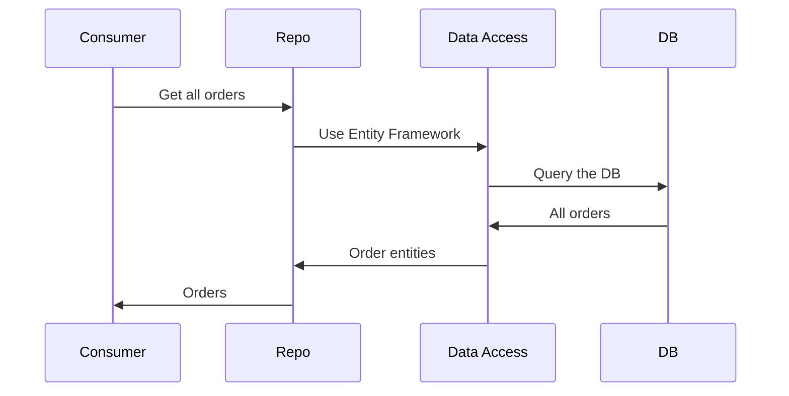

# Data Access in C# Fundamentals

## Overview

- Different types of databases
- How to use Entity Framework Core
- ADO.net
- Data access patterns repository
- NoSQL and non-relational databases

### Diff types of dbs

connectionstrings.com

### Scaffolding & ORM

Scaffolding makes it easy to reverse-engineer databases into entities  
thru the CLI

Migrations: A snapshop of changes done to the DB.

### ADO.NET

```code

dotnet add package Microsoft.Data.Sqlite
```

an alternative to using ORM, But must understand SQL syntax  
For High perofrmance situations & Total Control

### Repos, Unit work, Data Access Layer (Patterss)


