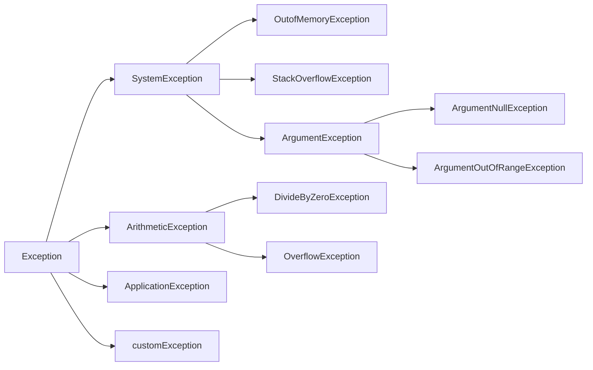

# Overview

- How to respond to runtime errors
- How to indicate an error occurred
- Errors represented by exception hierarchies
- How to rethrow and wrap exceptions
- Checking exception throwing code

## What are Exceptions ?

Theyre just objects inherited from System.Exception(baseclass).  
You can generate with the "throw" statement.  
Different Classes represent different errors and handled differently.

Exception definition sources:

- .NET
- external frameworks like NuGet
- Custom exceptions

## Understanding the Importance of Error Handling

### Exception Bubbling

Without handling exceptions, an error bubbles recursively up the callstack, resulting in a system/app crash.

```mermaid
sequenceDiagram

  MethodA->>MethodB: calls
  MethodB->>MethodC: calls
  MethodC-->>Exception: ERROR!
  MethodC-->>MethodB: Exception
  MethodB-->>MethodA: Exception
  MethodA-->>)System: System Cash
```

## Gettomg Started w Exceprtions

### how to create an exception & throw it

#### Try / Catch BLock

ex. methodC is called within a try/catch block inside methodB.  
This gives a "safetyNet" for it to be resolved in contained space.  
Basically, it's like giving an if/else statement for errors:  
"try" this code if it breaks,
"catch" the excception(s)

```c#
// Hierarchy of catch: Most specific --> Least specific
try
{
  //some operation(s)
}
catch(ArgumentNullException ex)
{
  //Handle ArgumentNullException
}
catch(ArgumentNullException ex)
{
  //Handle ArgumentNullException
}
catch
{
  //catch everything else
}
finally
{
  //always execute
  // ex. clean up code
}
```

### stack trace

chatgpt: why my code no work  
(jk)

## Understanding the Exception Class Hierarchy

<http://bit.ly/netexceptions>



### System.Exception.Properties

Message, StackTrace, Data, InnerException, Source, HResult, HelpLink, TargetSite

### Constructors in the Exception Class

```c#
public Exception() // Default Message property + null InnerException

public Exception(
  string message // User defined message
)

public Exception(
  string message,
  Exception InnerException // Wrapped exception
)
```

### Exception Guidelines

```

"System.ApplicationException is a class that should not be part of the .NETFramework.
The original idea was that classes derived from SystemException would indicate
exceptions thrown from the CLR(orsystem) itself, whereas non-CLR exceptions would be
derived from ApplicationException.  However, a lot of exception classes didn't follow
this pattern."

  - Microsoft
```

- An ApplicationException should not be thrown by your code
- An ApplicationException exception should not be caught
  (unless you rethrow the orignal excpetion)
- Custom exceptions should not be derived from ApplicationException

## Catching, Throwing, and Rethrowing Exceptions

- and advanced catching using exception filters

## Creating and Using Custom Exceptions

## Write Automated Tests for code that throws exceptions
