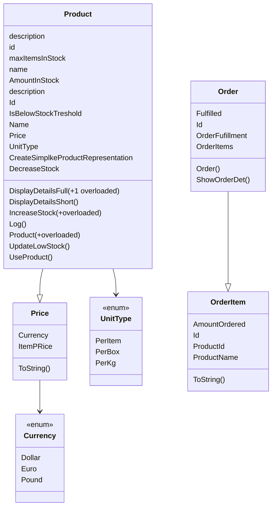

## Concept Goals

- Abstraction
- Enums
- Records
- interface
- Delegates
- CLI

## Business Needs

- An application for inventory management of ingredients
- Used by Inventory Managers in the warehouse
- Inventory updates when product is used
- some products are per item, kilo, perBox, etc
- Which products are "low on stock"
- Inventory Managers can create new orders
- Dollar, or pounds
- Storage Capacity dashboard
- Inventory Managers can add New Products



### Abstraction and Encapsulation

C# has a thing called "auto-properties".
in Java, you have to "manual everything"(or use lombok),

```java
public clas Product {
  private int id;
  private String name;\

  public int getId(){
    return id;
  }
  public void setId(int id) {
  this.name = name;
}
//setter getter for all other fields..
}
```

But with C#s auto-properties, you can forego manually writing fields  
 (if it's properties don't require more complex logic / validation, etc.)

```c#
public class Product
{
  public String Name { get; set; }
  public int Id {get; private set; }
}
```

- Encapsulation  
  So with C#s auto-properties, it creates backing fields which are (private)  
  with public access (properties). This uses the Encapsulation Principle.

- Analogy  
  Properties = Getters/Setters for Fields  
  Constructors = A Factory to create objects

### Composition

```c#
Price()
{

}
```
