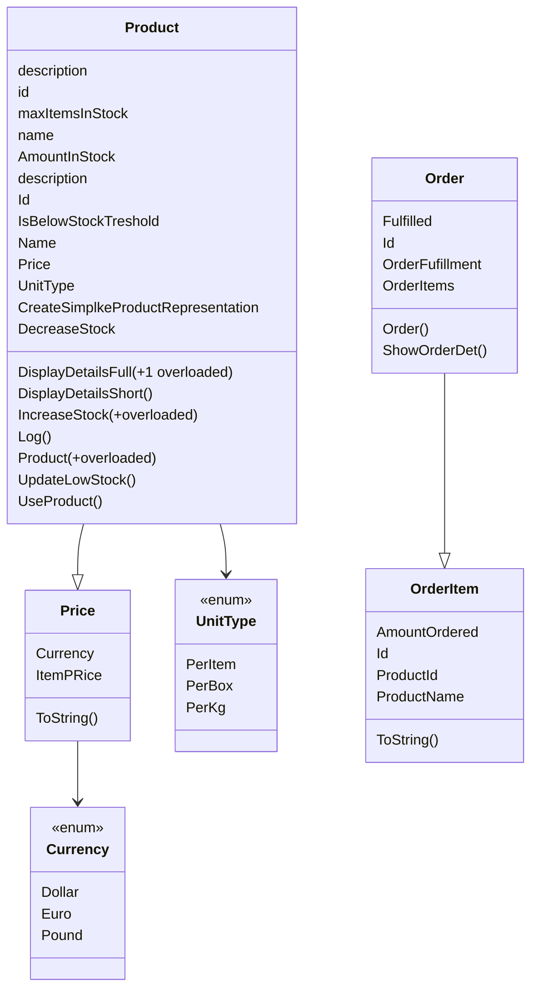

## Concept Goals

- Abstraction
- Enums
- Records
- interface
- Delegates
- CLI

## Business Needs

- An application for inventory management of ingredients
- Used by Inventory Managers in the warehouse
- Inventory updates when product is used
- some products are per item, kilo, perBox, etc
- Which products are "low on stock"
- Inventory Managers can create new orders
- Dollar, or pounds
- Storage Capacity dashboard
- Inventory Managers can add New Products



```c#
public class Products{}

```
